# 第一章 计算机系统基础知识
### 各种进制转化
* 十进制整数转化为二进制整数的方法是**除2取余法**,注意除到1的时候还要再除一次然后商0余1，十进制小数转化为二进制小数的方法是**乘二取整法**
* 二进制数转化为十进制的方法是：将二进制的每一位数乘以它的权，然后相加
* **其他进制的转换同理**

### 原码，反码，补码，移码
* 为了让二进制数可以表示数的**正负**于是采用八位二进制数与这几种表示方法
<table>
        <tr><td>码制</td><td>正数</td><td>负数</td><td>运算规则</td></tr>
        <tr><td>原码</td><td>01100010</td><td>11100010</td><td>最高位为符号位，0表示正数，1表示负数</td></tr>
        <tr><td>反码</td><td>01100010</td><td>10011101</td><td>在原码基础上，正数保持不变，负数符号位不变，其余位按取反</td></tr>
        <tr><td>补码</td><td>01100010</td><td>10011110</td><td>反码基础上，正数保持不变，负数加1</td></tr>
        <tr><td>移码</td><td>11100010</td><td>00011110</td><td>在补码的基础上，按符号位取反</td></tr>
</table>
<a href="https://www.bilibili.com/video/BV1hg411V7Bm?p=8&vd_source=38ba7512cb254a64f88ef9aa661c64f">b站视频详解</a>  

* 由于 **+0** 和 **-0**的区别，0的码制表示有点特殊
* 原码正数为00000000，原码负数为10000000。反码正数为00000000，反码负数为11111111.补码的正负都为00000000，移码的正负数都为10000000.
### 浮点数
* 小数点的位置可以根据需要左右浮动，采用科学计数法表示
* 二进制也可以使用浮点数，例如10101 * 2的110次方
* 浮点数的整数部分叫做阶码。
* **浮点数转二进制**
例：-37/64采用8位定点机器码表示

        1. 首先转化为分数的形式，如果分母是2的倍数那就很好做
        2. 然后再把分子转为二进制，注意数的最高位是符号位用1或0表示。
        3. 分子部分尾数根据分母转化为的2的次方，来进行右移(分母转化为乘的形式之后，阶码变为了负数)。
        4. 添加符号位，对于整数来说直接添加在最高位，对于小数来说，符号位应添加在小数点左边第一位。
        5. 补足位数，对于整数来说补足位数是在符号位后面，对于小数来说，位数应补足在最后一位后面

### 校验码
* **奇偶校验**

        在若干位有效信息，再在最高位加上一个二进制位(校验位)组成校验码
        1.奇校验：整个校验码中的1的个数为奇数
        2.偶校验，整个校验码中的1的个数是偶数
        可检查奇数位的错误，不可纠错。如果偶数个位数发生错误则发现不了
* 海明码
        也是利用了奇偶性，可纠错与检错
* 循环冗余校验码
        采用模二运算，可检错

### 中央处理器 p15
* **中央处理器的核心部件**

        1. 运算器
        算数逻辑单元ALU：数据的算数运算和逻辑运算
        累加寄存器AC(数据寄存器)：用于暂存操作数和中间运算结果并向ALU提供运算对象
        2. 控制器
        程序计数器PC：存储下一条要执行指令的地址，每取出一条指令，PC内容自动加1
        指令寄存器IR：存放正在执行的指令
### 指令系统
* 指令执行方式
        流水线技术可以加快指令执行速度
* 指令地址结构
        一条指令就是机器语言的一个语句，是一组有意义的二进制代码，由操作码和地址码组成
* 寻址方式

        1. 立即寻址方式：操作数在指令中，速度快，灵活性差。
        2. 直接寻址方式：指令中存放的是操作数的地址。
        3. 间接寻址方式：指令中存放了一个地址，这个地址对应的内容是操作数的地址。
        4. 寄存器寻址方式：寄存器存放操作数。
        5. 寄存器间接寻址方式：寄存器内存放的是操作数的地址.

### 存储系统

* 层次化的存储体系结构
        由速度快(容量小)到速度慢(容量大)排序为
        CPU——Cache(缓存)——内存(主存)——外存(辅存)
        它们分别对应
        寄存器——按内容存取——分两类：随机存储器(RAM)和只读存储器(ROM)——硬盘，光盘，U盘等等。

        1. 寄存器位于CPU中用于临时存放少量的数据，运算结果和正在执行的程序。
        2. 内存一般用于临时存储计算机运行时所需的程序，数据及运行结果。
        3. 外存用于长期存储数据。
* Cache(高速缓存)

        1. 用于解决内存与CPU之间工作速度不匹配的问题，比内存小一些，比寄存器大很多，存储速度与寄存器差不多，存储的内容相当于内存的副本。
        2. 利用cache改善系统性能的依据是——--程序的局部性原理。
* 主存储器：ROM和RAM

        ROM(只读存储器read only memory)：ROM中的内容在厂家生产时写入，其内容只能读出不能改变，断电内容不丢失。
        RAM(随机存储器)：既可写入也可读出，断电后信息无法保存，只能用于暂存数据，RAM又分为SRAM(Static RAM)和DRAM(Dynamic RAM)。
        SRAM:不断电的情况下信息一直保持不丢失。
        DRAM:信息会随着时间逐渐消失，需要定时对其进行刷新来维持信息不丢失。

* 主存储器：存储容量单位

        1. 字(word):计算机进行数据处理时，一次存取，加工和传送的数据长度称为字。字的位数可以是16位，32位，64位等。字长的概念就是一个存储单元的大小，一次传输的数据大小。
        2. 地址：整个内存被分为若干个存储单元，每个单元用地址(唯一的编号)来标识。
        3. 位(b/bit)：存放一位二进制数
        4. 字节(B/Byte)：8个二进制位一个字节

### 总线系统
* 总线系统划分

        1.芯片内总线：用于集成电路芯片内部各部分连接
        2.原件级总线：用于一块电路板内各元素的连接
        3. **系统总线/内总线**:最重要的总线，用于计算机各组组成部分(CPU，内存和接口等)的连接
        4.外总线/通信总线：用于计算机与外设或计算机与计算机之间的连接或通信

* 系统总线：系统总线性能

        1.总线的带宽(总线数据传输速率)：单位时间内总线上传输的数据量。总线的带宽等于总线的工作频率乘以总线的位宽再除以8(带宽通常是要转换成字节的所以要除以8)
        2.总线的位宽：能同时传送的二进制数据的位数，总线的位宽越宽，每秒钟数据传输率越大，总线的带宽越宽
        3.总线的工作频率：以MHZ为单位，工作频率越高，总线工作速度越快，总线带宽越宽
* 系统总线：三总线系统

        1.**数据总线**：CPU与内存或其他器件之间的数据传送的通道，决定了CPU和外界的数据传送速度。每条传输线一次只能传输一位二进制数据，“64位的CPU”就是指CPU的数据总线宽度为64位，字长取决于数据总线的宽度。也就是说字长(一个存储单元的大小)，位宽，数据总线的条数，在通常情况下的取值是相同的。
        2. **地址总线**：CPU是通过地址总线来指定存储单元的，它决定了CPU所能访问的最大内存空间的大小。例如：若计算机的地址总线宽度为32位，则最多允许直接访问4GB的物理空间，有32条总线，一个总线只能传输0或1，那它就有2的32次方种排列组合，2的二次方乘以三个2的十次方，也就是4GB。一个CPU的寻址能力(CPU所能访问的最大内存空间的大小)为8kb，那么它的地址总线的宽度为13。(1GB=1000MB,1MB=1000KB,1KB=1000B)
        3. 控制总线：对外部器件进行控制，其宽度决定了CPU对外部器件的控制能力。
        4.例：设有一个64k*32位的存储器(前一个数字表示地址总线，后一个数字表示数据总线)(每个存储单元是32位)，其存储单元的地址宽度为64k=2的16次方，地址总线宽度为16位。这里的32位可以说是每个存储单元为32位，也可以理解为数据总线的条数为32。或者字长为32，或者位宽为32。

# 多媒体基础知识

### 媒体的种类
* 媒体的概念和分类

        1，媒体
        传播信息的载体：语言，文字，图像，视频等。
        存贮信息的载体：如ROM,RWM,磁带，光盘等。
        2.多媒体的分类
        感觉媒体：使人产生感觉的媒体。
        表示媒体：传输感觉媒体的中介，用于数据交换的**编码**
        表现媒体：进行信息输入输出的媒体，例如键盘，显示屏。
        存储媒体；用于存储表示媒体的物理介质。
        传输媒体：传输表示媒体的物理介质。

### 音频
* 音频的参数

        1.幅度：声波的振幅，以分贝(dB)为单位
        2.频率：说话的频率是300到3400hz，人耳能听到的频率是20到20khz，超声波和次声波就是超出这个范围的
* 声音信号的数字化

        1.采样：采样频率，频率越高声音越真，采样的频率应为声音最高频率的两倍。
        2.量化：A/D转换(模数转换)，样本用二进制表示，位数多少反应精度。
        3.编码：按照一定的格式进行数据编码。
* 音频格式文件：.wav .mp3

### 图形和图像
图形和图像
* 图形(矢量图)：基本元素为图元，用数学的方式来描述一幅图，放大缩小等变换后不会损失画面细节，存储空间小。
* 图像(位图)：基本元素为像素，用若干二进制位来指定像素的颜色，亮度和属性。放大后会失真。主要参数有分辨率，色彩模式，颜色深度。

图像的基本参数
* 图像分辨率

        1. 一幅图片的像素密度，每英寸多少点(dpi)表示图像的大小
        2. 200dpi扫描一幅2 * 2.5英寸的照片，则可以得到400*500像素点图像(一英寸乘以100dpi)
* 像素深度

        1. 存储每个像素所用的二进制数，度量图像的色彩分辨率
        2. 图像深度为b位，则该图像最多的颜色数或灰度级为2的b次方种
        3. 对于8位的单色图像，灰度为2的8次方=256

显示器的基本参数
* 刷新频率

        1.图像在显示器上的更新速度
        2.刷新频率越高，屏幕的闪烁感就越小，图像就越稳定，视觉效果也越好
* 对比度

        1.显示器全白画面亮度与全黑画面亮度的比值
*显示分辨率

        1.显示屏上能够显示的像素数目
        2.分辨率越高，项目越清晰

# 操作系统

### 操作系统概述01
操作系统的基本概念

* 操作系统是组织与管理软件，硬件资源以及计算机系统中的工作流程，并控制程序的执行，向用户提供接口。

操作系统的五大部分
* 进程管理：进程控制，进程同步，进程通信，进程调度。
* 文件管理: 文件存储空间管理，目录管理，文件的读写管理，存取控制。
* 存储管理：存储分配与回收，存储保护，地址映射(变换)，主存扩充。
* 设备管理： 对硬件设备的管理，对输入输出设备的分配，启动和完成和回收。
* 作业管理： 任务、界面管理，人机交互、图形界面、语音控制、虚拟现实。

### 操作系统概述02
操作系统的分类
* 批处理操作系统

        1. 单通批：一次一个作业进入内存，作业由程序，数据，作业说明书组成
        2. 多道批：一个多个作业进入内存，因此宏观上来说是并行，而微观上，如果只有单处理器，那它一次只执行一个进程，因此是串行。

**分时操作系统**
* 采用时间片轮转的方式为多个用户提供服务，为多个用户平均轮流分配时间，每个用户感觉独占系统。
* 特点：多路性、独立性、交互性和及时性。

实时操作系统
* 实时控制系统和实时信息服务。
* 交互能力要求不高，可靠性要求高。

网络操作系统
* 方便有效共享网络资源，提供服务软件和有关协议的集合
* 主要的网络操作系统有：Unix、Linux和windows sever系统

**分布式操作系统**
* 任意两台计算机可以通过通信交换信息。
* 是网络操作系统的更高级形式，具有**透明性、可靠性、和高性能等特性**。

微机操作系统
* Windows：Microsoft开发的图形用户界面、多任务、多线程操作系统。
* Linux：免费使用和自由传播的类unix系统，多用户、多任务多线程和多CPU的操作系统

嵌入式操作系统
* 运行在智能芯片环境中。
* 特点：微型化、可定制、实时性、可靠性。

### 进程管理
进程的三态模型
* 进程管理(处理机管理)：在计算机系统中资源分配和独立运行的基本单位

        1.运行；进程在处理机上运行。单处理机系统，处于运行状态的进程只能是一个。
        2.就绪：进程获得了除处理机以外的一切所需资源，一旦得到处理机即可运行。
        3.等待：也叫阻塞或睡眠状态，一个进程正在等待某一事件的发生而暂停或停止运行

信号量机制
* 信号量s：整型变量，并根据控制对象进行赋值。S>=0表示资源可用数，S<0表示排队进程数。假如有十个资源，20个进程，那么可用资源每执行一个进程就少一个，在所有资源用完后剩下的进程就会排队，以-1到-10表示
* 死锁：多个进程在运行过程中因争夺资源造成的一种僵局，当进程处于这种僵持状态时，若无外力作用，他们都无法再向前推进。
1.例题：假设有四个进程三个资源，那么至少有几个资源时不会产生死锁，当四个进程每个都不能分配到三个的时候就会产生死锁，只要有一个进程凑齐了三个那么就会释放资源，此时其他进程的资源就肯定够了。所以当四个进程每个都只抢到两个资源，也就是最多8个资源时会产生死锁。

同步和互斥
* 进程通信：各个进程交换信息的过程
* 分类：同步(直接制约)要求两个进程同时完成时、互斥(申请临界资源间接制约)进程争夺资源就是互斥关系

### 存储管理
* 分区存储管理：静态分区分类和动态分区分类
* 分页存储管理：每页**大小相同**，页号表示页的范围，页内地址表示每页容量。
* 分段存储管理：每段的大小不等吗，段号表示段的范围，段内地址表示每段最大的容量
* 段页式存储管理：先将用户程序分为若干个段，再把每个段分为若干个页。
* 虚拟存储管理：主存加辅存的虚拟存储结构，最大容量由计算机系统和外存空间决定的。

### 设备管理
* 机械硬盘技术指标：道密度，平均存储时间，寻道时间，等待之间，数据传输率。
* 数据读取时间：由磁道探索，扇区探索，数据传输三个部分组成
* 磁盘调度算法：先来先服务算法(随时改变)，最短寻找时间优先调度算法(随时改变)，电梯调度算法(可能改变移动臂的移动方向)，单向扫描调度算法(不改变移动臂的移动方向)
* 磁盘清理和磁盘碎片整理：整理不会清理，但会使访问文件的速度变快。

### 文件管理
文件管理的基本概念

* 文件：具有符号名的，在逻辑上具有完整意义的一组相关信息项打的集合

文件目录
* 文件目录项/文件的说明/文件控制块FCB

        1.基本信息类：文件名，文件的物理地址，文件长度和文件块数等。
        2.存储控制信息类：文件的存储权限：读写、执行权限等。
        3.使用信息类：文件建立日期，最后一次修改/访问日期。
* 目录结构

        1. 一级目录结构：有一个目录文件夹
        2. 二级目录结构：主文件目录和用户目录
        3. 三级目录结构：树形目录结构，由根目录及众多目录组成，最常用。

文件路径
* 绝对路径：从根目录开始的路径
* 相对路径：从用户当前工作目录下开始的路径

文件命名规则
*在文件命名时，不允许使用的字符有问号、双引号、正反斜杠、大于小于号、中竖线、冒号。
* 同一文件夹下不允许有同名的文件夹，不区分大小写。

文件管理
* Windows中系统对用户的默认权限情况

        1.administrator：管理员组，不受限制的完全访问。
        2.power user：
        3.users：
        4.everyone：
        5.guests：

### 作业管理
用户界面设计原则
* 用户界面(User interface)：计算机中实现用户与计算机通信的软件、硬件部分总称，也称为用户接口或人机界面。
* 原则

        1.简易性：便于使用和理解。
        2.用户的语言：友好人性化提示。
        3.记忆负担最小化
        4.一致性：术语一致，风格和内容一致。
        5.从用户的观点考虑
        6.排列分组：有序整齐方便查找和使用。
        7.安全性：选择可逆，出错有提示。
        8.人性化：根据用户需求定制。

# 程序设计语言

### 程序设计语言及其构成
程序设计语言
* 计算机主要通过程序或指令来控制才能完成各种任务。
*程序设计语言(计算机语言)：人与机器交换信息的语言。
* 阶段

        1. 机器语言(低级语言)：二进制指令代码，直观性差，容易出错，计算机直接执行。
        2. 汇编语言(低级语言)：用简单的符号代替部分指令，需要转化后执行。
        3. 高级语言：更符合人的思维，易读易记，便于推广，有解释和编译两种执行方式。

高级程序设计语言划分
* 面向过程语言：

        1.命令式语言：FORTRAN,ALGOL,VOBOL,C和Pascal等
        2.结构化语言(也属于命令式)：C，Pascal等
        3.函数式语言：Lisp等
        4.逻辑式编程语言：Prolog等
* 面向对象语言：PHP,Delphi,Java,C++,Python,C#等

* 从程序执行角度划分

        1.编译类程序设计语言：C、C++、Delphi、Java等
        2.解释类程序设计语言：Python、PHP、JavaScript等。
        3.脚本语言：通常为解释执行，JavaScript为客户端脚本语言，Python、PHP为服务器端脚本语言。

常见的高级程序语言
* Fortran语言：第一个高级程序设计语言
* SQL：结构化查询语言，特殊目的的编程语言，用于查询、更新和管理关系数据库
* 通用的程序设计语言：C、C#
JAVA、PHP、Python和JavaScript等。

        1.C语言：通用、结构化程序设计语言，简洁，丰富可移植性，**能访问操作系统和底层硬件**
        2.C#语言(读作C Sharp)：面向对象。
        3.C++语言：在C语言基础上添加了类机制，面向对象，高效。
        4.Java语言：面向对象，跨平台，通用的程序设计语言。
        4.PHP：服务器端执行，嵌入HTML文档的脚本语言，制作动态网页。
        Python：面向对象，解释型程序设计语言，通用的脚本语言。
        JavaScript语言：脚本语言，为网页添加动态功能。
* 标记语言：非编程语言，不包含任何逻辑或算法

        1.HTML：超文本标记语言
        2.XML：可扩展标记语言
        3.XHTML：扩展的超文本标记语言

程序设计语言的构成
* 数据成分：常量，变量，全局量，局部量以及数据类型。
* 运算成分：程序语言允许使用的运算符号及运算规则。
* 控制成分：顺序结构、选择结构、循环结构。

### 表达式

 表达式的类型和转换规则
* 前缀表达式(+ab)
* 中缀表达式(a+b)
* 后缀表达式(ab+)

考试常考中缀表达式和后缀表达式的互相转换。
* 例如：(a-b)*(c+5)根据运算顺序转为后缀表达式它就是：ab- c5+ *
a-b*c+5它的后缀表达式是：a bc* - 5+。

栈和队列
* 栈和队列是两个相对的概念 

        1. 队列:类似排队来进行服务，先进去的会先提供服务，然后先结束。它遵循先进先出。
        2.栈：栈的一端是封闭的，叫做栈底，另一端叫做栈顶。程序执行时在栈顶这一端入也是从栈顶这一端出。它遵循的规则就是先进后出，先进去的要最后才能出来。 

### 传值和传址调用

数据类型
* 按数值是否改变分为常量和变量

        1.常量：只有右值，值不能改变。
        2，变量：有左值和右值，值可改变。

* 按作用域分为全局变量和局部变量

        1.全局变量：存储空间一般不变
        2，局部变量：存储空间动态变化。

* 按数据类型分

        1.基本类型：int、char、float、double、bool
        2.特殊类型:void.
        3.用户定义类型：enum
        4.构造类型：数组，结构，联合
        5.指针类型：type*
        6.抽象数据类型：类类型

传值和传址调用
* 传值调用：形参取的是实参的值，形参的改变不会导致调用点所传的实参的值发生改变。
* 引用(传址)调用：形参取的是实参的地址，即相当于实参存储单元的地址引用，因此其值的改变同时改变了实参的值。

### 语言处理程序
语言处理程序：将高级语言转换成计算机可执行的机器语言，分为汇编、编译和解释程序。
* 汇编程序：翻译由汇编语言编写的程序
* 解释程序：针对高级语言编写的源程序，直接解释执行源程序。
* 编译程序：源程序翻译成目标语言程序，然后执行目标程序。

解释程序并不产生目标程序，这是他和编译程序的主要区别，解释程序在在执行时逐条解释并且每次解释都要参看原程序，而编译程序直接整体转换为目标程序，因此编译的速度要比解释的快一些。

### 编译程序
编译过程
* 源程序——词法分析——语法分析——语义分析——中间代码生成——代码优化——目标代码生成——目标代码
* 词法分析：从上到下，从左往右逐个扫描源程序中的字符，这个阶段去除注释
* 语法分析：从整体的语言结构上分析，它找出来的错误叫做语法错误。
* 语义分析：能够找到静态的语义错误，静态语义错误只有一种，就是运算符与运算类型不匹配，如取余时用浮点数。
* 符号表管理穿插始终，查找符号的含义。
* 出错处理也贯穿始终。

出错处理
* 静态错误

        1.编译时所发现的程序错误(编译正确的程序没有静态错误)
        2.分为语法错误和静态语义错误，单词拼写错误，标点符号错误，表达式中缺少操作数都是语法错误。

* 动态错误

        1.它发生在程序运行时(程序可通过编译)
        2.比如陷入死循环，变量取零是做除数，引用数组下标越界等错误。

# 数据结构与算法基础
### 顺序表和链表

数据结构
* 结构是指元素之间的关系
* 逻辑结构：元素之间的相互关系称为数据的逻辑结构，可分为线性结构和非线性结构。

        1.常用的线性结构：线性表，栈，队列，数组和串。
        2.常见的非线性结构有：二维数组，多维数组，树。
* 存储结构：数据元素和元素之间的存储形式称为存储结构，可分为顺序存储和链接存储。

        1. 顺序存储结构(顺序表)：对于相邻的数据元素，它们的存放地址也相邻，
        2. 链式存储结构(链表)：相邻数据元素可随意存放，但所占存储空间分为两部分，一部分存放结点值，另一部分存放表示节点关系的指针

顺序表(顺序存储结构)
* 顺序存储方式：内存是连续分配的，并且是静态分配的，使用前需要分配固定大小的空间。
* 

链表(链式存储结构)
* 链表存储方式：链表的内存不是连续的，前一个元素存储的地址的下一个地址中存储的不一定是下一个元素。访问某节点应找上一节点提供的地址，每一个结点都有一个指针变量存放下一个结点的地址。数据元素的逻辑顺序是通过 链表中的指针链接次序实现的。
* 链表中的每一个元素称为结点，每一个结点是一个结构体变量，它有若干个成员组成：

        1.数据部分：可有若干项(整，实，字符，结构体类型等)
        2.指针变量：通常具有指向自身结构体类型的指针变量，存放下一个结点的地址，最后一个结点(表尾)的地址部分为NULL

两种存储方式在操作元素时的特点
* 访问第i个元素

        1.链表需要从头到尾开始找，而顺序表可以直接找到。
* 查找是否含有某值

        1.两种存储方式相同，从前往后依次去找。
* 删除第i个元素

        1.链表在更改时只需要改变i元素前一个元素的地址指向i元素后一个元素的地址即可，而顺序表在删除中间的元素后剩下的元素都必须往前移。
* 在第i个元素前插入某值

        1.链表只需要改变i元素前后两个元素的地址指向即可插入，而顺序表在插入后后边的元素都需要往后移动。

### 数组
数组的概念
* 数组是n个数据类型相同的元素组成的序列。

        1.空间连续，统一划分。
        2.元素类型相同，每个元素占用的存储单位相同。
        3.下标有序，n个元素，下标是0到n-1。
         
一维数组与二维数组的偏移量计算
* 偏移量：数组中某一个元素的地址相对于首元素的地址的差值就是偏移量。
* 偏移量计算：计算偏移量的实质就是计算该数组元素前面有几个元素与所占用存储单元的地址的乘积。
* 例子：A[i]的存储地址为：a(首元素) + i * len(存储单元)，它的偏移量就是i * len。
* 对于二维数组：例如A[i][j]那么它的偏移值就是i * 该数组一行的元素个数(列数) + j。
* 注意
        1.总个数：最大编号-最小编号+1。
        2.计算行数看行号变化，计算列数看列数变化。

### 字符串

概念
* 字符串是由字符(数字，字母，下划线等)构成的一维数组。

* ASCII码：是一种字符编码成二进制的一种方式，例如A的值为65，a为97。在ASCII码中A<B<C - <Z<a<b<c-z

* 空串：无任何字符的字符串。
* 空白串：由空白字符(空格，制表符)构成的串。

### 矩阵
* 特殊矩阵

        1.三角矩阵
        2.对角矩阵
        3.对称/反对称矩阵
* 非特殊矩阵

        1.稀疏矩阵：非0元素很多。用三元组表来存储非0元素。
* 矩阵乘法
        1.行乘列，两个矩阵相乘，第一行第一个乘以第一列第一个，第一行第二个乘以第一列第二个，然后相加。
        2.例:<a href="https://www.bilibili.com/video/BV1hg411V7Bm?p=56&vd_source=38ba7512cb254a64f88ef9aa661c64fe">b站详解</a>

### 栈(queue)和队列(stack)

* 队列就如同排队一样，先进的程序先出。
* 栈的规则是先进后出，就像一个桶一样，有栈顶和栈底，先进入的在栈底，出的时候也就只能后出。
* 注意栈的作用主要是用于函数调用，函数嵌套，和递归函数等等。

### 树的基本性质
树的基本概念
* 父结点，子结点，兄弟结点(同一个父结点)
* 叶子结点(没有孩子结点)，结点的度(有几个孩子)，树的度(结点的度的最大值)
* 二叉树的性质就是它树的度不超过两个。
* 层(树的深度或者高度)

二叉树的划分
* 满二叉树：不能再添加其他元素
* 完全二叉树：只有树的最后一层有缺失的元素，且右边是连续的有左边是连续的无。
* 非完全二叉树，不是最后一层缺失，或者右边不是连续的有。

二叉树的特性
* 在二叉树的第i层上最多有2的i-1次方个结点
* 深度为k的二叉树最多总共有2的k次方减一个结点
* **如果有一颗n个结点的完全二叉树的结点按层序编号(从第一层到log以2为底的n+1层，每层从左到右编号)，则对任意结点i有如下规律**

        1.如果i = 1 ,它是二叉树的根。
        2. 当父结点为i时它的左子节点总是为2i，而右子节点总是为2i + 1.

### 特殊二叉树
二叉查找/排序树

* 特点：左子树小于根节点，右子树大于根节点。

* 插入节点，假设有一个序列为(89，48，56, 48，20, 112, 51)，它作为二叉查找树的插入规则是：

        1. 将要插入的结点与父结点值比较，确定放在左子树还是右字数中，若子树为空则作为子树的空结点插入。
        2. 若该键值结点已经存在，则不在插入。

哈夫曼树

* 树的路径长度：从根节点到这个叶子结点的有几段。
* 权：某节点带的值。
* 带权路径长度：结点到树根之间的路径长度与该结点上权的乘积。
* 树的带权路径长度(树的代价)：树中所有叶结点的带权路径长度之和

* 哈夫曼树的构造方式：

        1.每次在权值组中找到最小的两个数，去构造一颗子树
        2.把两个子树之和加到新的权值组里面，然后删除那两个子树。
        3.继续找新的权值组里面最小的两个数，然后以此类推

### 图

图的分类
* 完全图
        1.无向图(不带箭头的图)：若每对顶点之间都有一条边相连，则称为完全图
        2.有向图(带箭头的图)：若每对顶点之间都有两条有向边相互连接，则称该图为完全图。

* **n个顶点的无向图和有向图的完全图的边的个数为多少？**
        1.一个顶点与其他顶点都要连接，即n * (n - 1)，每个点都多算了一次，因此最后的公式是n * (n - 1) / 2
        2. 有向图因为每个结点都有两个箭头，因此要乘以2，公式即为n * (n - 1)

* 连通图：任意两个顶点之间都有一个路径相连(注意并不是都有边)。

图的转换：无向图转邻接矩阵
* 用一个n阶方阵来存放图中各结点的关联信息。
        1.有几个结点就是几阶方阵。
        2.方阵中只有0和1，每个0和1都对应一个行号和列号，行号和列号表示的就是结点，0表示这两个结点没有邻接边，1表示这两个结点有邻接边。
* 无向图转换的邻接矩阵是对称矩阵。
* 有向图的转换方式与无向图相同。

入度与出度的概念
* 概念：入度指的是，指向这个结点的结点个数。出度指的是，这个结点指向多少个其他的结点。
* 从邻接矩阵中如何看出入度：出度就看一行中有几个非0，入度就看一列中有几个非0.

有向图转邻接链表
* 首先把每个顶点的邻接顶点用链表示出来，然后用一个一维数组来顺序存储。简单说就是有几个节点就用几条链表示，然后把与之相连的节点连在后面。

### 查找

顺序查找
* 将待查找的关键字跟表中的数据从头到尾按顺序进行比较。

二分法查找(折半查找)
* 条件：仅适用于元素有序的顺序表。
* 查找方法：

        1.将表中的最大值设为high最小值设为low，中点的位置mid则为（low + high）/ mid
        2.将mid与待查找的key比较
        3.如果key < mid,则从左边开始查找，查找范围变为，low到mid-1。再low加mid-1除以2找到新的mid，再比较。
        3.如果key > mid，则从右边开始查找，mid + 1到high，然后继续找新的mid。

散列查找法(哈希查找)：线性探查法
* 简单说就是根据关键码的值，然后用相应的关系来将他们存储。
* 将关键码取余，余数为几就存储在几号地址空间，当取余的结果相同时，这个值放在后面最近的空闲的存储空间里面
* 还有一个拉链法，与线性探查法差不多，其差别是拉链法在存储相同的取余结果时，它把这个值存储在同一个链里面

### 排序

排序的概念和分类
* 排序的概念

        1.稳定排序和不稳定排序：排序之后相同元素的先后顺序一定不变化那就是稳定排序，如果变化的就是不稳定排序。如果一个排序方式是两个元素隔几个元素进行交换的话，他就是不稳定排序。
        2.内排序和外排序：通过内存来排序的是内排序，通过内存和外存来排序的是外排序。

* 直接插入排序

        1.在一排乱序的元素中，从第二个元素开始，让第二个元素与第一个元素做比较，比他小的话就排到前面，比它大的话就不动，当不动时就换下一个元素继续比较找到合适的(不动的)位置，它简单明了，但是速度很慢。
        2.此内容与c程序息息相关。适用于元素基本有序的情况。

* 希尔(shell)排序

        1.基本原理就是先让元素基本有序，再适用直接插入排序。

        2.选择一个增量，从第二个元素开始，与隔这个增量的元素比较，后面的小就交换。
        3.使增量慢慢变小，最后当增量变为1的时候，相当于每个元素都参与比较。也就是直接插入排序。

* 交换类排序

        1.冒泡排序：相邻元素两两之间比较并交换，前面元素中的最大值会在两两交换的过程中像气泡一样一直往后移，移到最后时最大值的位置确定，在第二趟时第二大的数也会一直后移，然后确定位置。
        2.快速排序：选择第一个元素为基准值，下标最小的和下标最大的进行比较，后面大就不变后面的小就交换，交换后第一个值就确定不动了，再用下标倒数第二小的数与下标最大的进行比较，最后的结果就是，基准值慢慢移动到中间，左边的值都比它小，右边的值都比它大。

* 选择类排序

        1.直接选择排序：在所有元素中直接找到最小的放到第一个，再找第二小的放到第二个。以此类推。
        2.堆排序：分为小顶堆和大顶堆，小顶堆就是所有的子节点都比父节点要大，大顶堆就是所有的子节点都比父节点要小。

* 归并和基数排序

        1. 归并排序：两个元素为一组来进行比较交换。
        2.基数排序：适合于元素很多而关键字很少的序列。

# 软件工程
### 软件工程概述
软件生存周期
* 软件: 包含程序，数据及相关文档。
* 软件工程：涉及到软件开发、维护、管理等多方面的原理工具和环境。最终的目的是开发高质量的软件。
* 软件生存周期

        1.问题定义：要解决的问题是什么。
        2.可行性分析：研究问题的范围，是否值得去解，是否有可行的解决方法。
        3.需求分析：确定软件系统必须做什么，确定功能、性能、数据和界面要求，确定逻辑模型。
        4.总体设计：概括的说，如何解决这个问题？指定推荐系统的详细计划并设计软件的结构。
        5.详细设计：怎样具体实现这个系统？对模块完成的功能进行具体描述。
        4.编码和单元测试：写成某种特定程序设计语言表示的源程序清单及测试每一个模块。
        5.综合测试：通过各类型的测试使软件达到预定的要求。
        6.维护：通过各种必要的维护活动使系统持久满足用户的需要。

* 文档的作用

        1.提高软件开发过程的能见度。
        2.提高开发效率，便于发现错误和不一致性。
        3.作为开发人员在一定阶段的工作成果和结束标志。

软件生存周期模型
* 瀑布模型(waterfall model):依线性顺序连接起若干阶段的模型，适合需求明确的模型，缺乏灵活性。
* 演化模型：先给出模型，然后再根据用户需求修改。
* 增量模型：先把任务分为几个模块，然后先给出某个模块的模型。
* 螺旋模型：结合以上两种并加入风险分析。
* 喷泉模型:主要适用面向对象开发

软件开发方法
* 结构化方法：自顶而下、逐层分解。原则是分解与抽象，开发周期长，不适用大规模、复杂的项目以及变化的需求。
* 面向对象开发方法：包括面向对象分析、设计与实现，适合比较复杂的项目模型。
* 原型化方法：适合用户需求不清晰、需求经常变化的情况适合小规模的项目。

### 软件设计
软件设计原则：抽象，模块化，信息屏蔽，模块独立。
* 内聚：模块内的交互程度。
* 耦合：模块间的交互程度。
* 在程序开发中我们希望程序的各个模块**高内聚低耦合**

内聚和耦合
* 内聚类型

        1.功能内聚：最强的内聚，完成一个单一功能，各个部分协同工作，缺一不可。
        2.顺序内聚和过程内聚，他们都有次序的要求。
        3.通信内聚：所有结构集中在一个数据结构上。

* 耦合类型

        1. 非直接耦合：它是模块独立性最强的，耦合性最低的，是我们最希望的耦合类型。它的两个模块之间没有直接关系，分别从属于不同模块的控制和调用。之间不传递任何信息。
        2. 其他类型基本不考。

### 软件测试——测试用例
软件测试过程
* 单元/模块测试：模块编写完成且无编译错误后进行，由程序员对自己编写的模块自行测试，主要发现编程和详细设计中产生的错误，测试计划应该在详细设计阶段制定。一般使用**白盒测试**。

* 集成测试：把各模块组合起来测试，集成测试计划应该在概要设计阶段制定。(黑盒测试)

* 确认测试：检查软件的性能是否与用户的需求一致，经过管理部门的认可和专家的鉴定之后，软件即可交给用户。(黑盒测试)

* 系统测试：把软件放在硬件和网络环境中进行测试。(黑盒测试)

黑盒测试和白盒测试
* 静态测试：不运行代码，通过检查代码测试

        1. 人工检测
        2. 计算机辅助静态分析

* 动态测试：

        1. 黑盒测试/功能测试：它分为等价划分类，边值分析，错误推测，因果图。不用全记，出现这个类型的时候，要知道是属于白盒还是黑盒。
        2. 白盒测试/结构测试：分为逻辑覆盖，覆盖循环，基本路径测试。逻辑覆盖中又分为语句覆盖和路径覆盖等。
        3.语句覆盖：被测程序的每个语句至少执行一次。当遇到选择分支时它也只会走其中一个分支。是一种很弱的覆盖标准。
        4. 路径覆盖：覆盖所有可能的路径。所有的分支都走一遍。
        5. 测试用例指的是测试程序时输入的例子。
### 软件运行与维护
软件维护
* 可维护性的决定因素：可理解性，可测试性，可修改性。
* 软件维护类型

        1.正确性维护，20%，程序发生错误时进行的修改
        2.适应性维护，20%，使软件适应新技术而和管理需要所做的修改。
        3.预防性维护，占比最少大概4%，为了适应未来的软硬件环境的变化而做的修改。
        4.完善性维护，占比最多大概50%，为了扩充功能和改善性能而进行的修改，对已有的软件增加更多功能。

# 面向对象的基本知识
### 面向对象的基本概念
面向对象由**对象**组成，对象又有**分类**，类与类之间常常是有联系的，他们通常是**继承**的关系，对象与对象之间**通过消息的通信**来传递数据。

对象 ：现实世界中每个实体都是对象。每个对象都要它的属性(数据)+方法(操作)+对象ID
* 假设有一个对象ID为张三，它的属性为男，可执行的操作有约会(){...} 

* 然后再将其分类为class 男人 {属性... 方法...}  class 女人{属性... 方法...}

* 男人和女人又可以归为一个大类，也就是人。class Person{属性... 方法...}。这体现了继承的思想。

对象：程序系统中基本运行的实体，包括**数据和数据的操作**。一个对象把**属性和行为**封装成一个整体，实现生产者与使用者的分离。一个对象通常是由**对象名、属性、和方法(操作)** 三部分组成。

类：定义了一组大体上相似的对象。类是对象的抽象，对象是类的具体化，是类的实体。特殊类是一般类的子类，一般类是特殊类的父类。

继承：父类与子类之间共享数据和方法的机制。一个父类可以有多个子类，一个子类可以继承其父类中的属性和方法。

重置/覆盖：是一种动态绑定机制，使得子类在继承父类的前提下，用适合自己要求的实现，去置换父类中的相应实现。

消息：对象之间的通信构造。

消息传递：当一个消息发送给某个对象时，包含要求接收对象去执行某些活动的消息。接收到信息的对象经过解释，然后予以响应。

过载多态(考点)：同一个名(操作符，函数名)在不同的上下文中有不同的类型。

### UML
UML语言：统一建模语言(Unified Modeling Language)是面向对象软件的标准化建模语言。

三要素：基本构造块、放置规则和语言公共机制。

**UML构造块：事物，关系和图。**
* 事物：是对模型中最具有代表性的成分的抽象。
* 关系：用来把事物结合到一起，包括依赖、关联、**泛化和实现关系(特殊的继承关系)**。
* 图：聚集了相关的事物。

UML(事物)
* 结构事物：UML模型中的名词，模型的**静态部分**，描述概念或物理元素。包括：类(Class)、接口(Interface)、协作(Collaboration)、用例(UseCase)、主动类(ActiveClass)、组件(Component)、和节点(Node)。
* 行为事物：UML模型的**动态部分**，描述了跨越时间和空间的行为。如交互(Interaction)、状态机(State Machine)和活动(Activity)。
* 分组事物 ：UML组织部分，是一些由模型分解而成的“盒子”，如包(Package)
* 注释事物：UML模型的解释部分，这些注释事物用来描述、说明和标注模型的任何元素，如：注解(Note)。
* 出题方法就是问你这些名词是属于哪种事物。

UML(图)
* 类图：一组**对象、接口、协作**和他们之间的关系
* 对象图：一组**对象**以及他们之间的关系
* 用例图：**用例、参与者**以及他们之间的关系。
* 组件图：一组**构建**之间的组织和依赖，专注于系统的静态实现视图。
* 部署图：运行**处理结点以及构建**的配置，给出体系结构的静态实施视图。
* 序列图：以**时间顺序组织**的对象之间的交互活动。
* 状态图：展现了一个**状态机**，由状态、转换、事件和活动组成。
* 活动图：专注于系统的动态视图，**一个活动到另一个活动**。
* 交互图：结合了序列图和活动图的特征。
* 定时图：关注对象在**改变状态**时的时间约束条件。

### 设计模式

设计模式：是众多软件开发人员经过想当长时间的试错和错误总结出来的，代表了最佳的实践。设计模式是软件开发人员在软件开发过程中面临的一般问题的解决方案。

**考试中常常会考到这个设计模式是属于哪个类型的**

设计模式的类型

* 创建型模式

        1. 工厂方法模式
        2. 抽象工厂模式
        3. 原型模式
        4. 单例模式
        5. 构建器模式

* 结构型模式

        1. 适配器模式
        2. 桥接模式
        3. 组合模式
        4. 装饰模式
        5. 外观模式
        6. 享元模式
        7. 代理模式

* 行为型模式

        1. 职责链模式2. 命令模式3. 解释器模式4. 迭代器模式5. 中介者模式 6. 备忘录模式7. 观察者模式8. 状态模式9. 策略模式 10. 模板方法模式11. 访问者模式

记忆的时候只需记忆创建型和结构型即可。剩下的就是行为型模式。

# 数据库
### 数据库系统
数据库系统的基本概念
* 数据data：描述事物的符号记录，可以是文字、图形、图形、声音和语言等。
* 数据库database：长期存储在计算机内、有组织、可共享的数据集合。
* 数据库管理系统**DBMS(database manage system)**:由数据库、硬件、软件和人员4大部分组成，主要功能有数据定义，数据库操作，数据库运行管理，数据组织，存储和管理，数据库的建立和维护及其他功能。

三层模式两层映射
* (视图级)外模式：用户视图下显示的系统内容，例如银行查询是显示的个人信息。
* (表级)概念模式：用户视图中的内容由表级模式中的内容提供，例如银行的后台，只有工作人员能看到的所有的储户的信息。
* (文件级)内模式：存储所有信息的地方，例如银行的物理数据库。
* 两个模式之间会有一层映射，把模式与模式之间联系起来。映射的名称就是两个模式组合，例如外模式-概念模式映射。

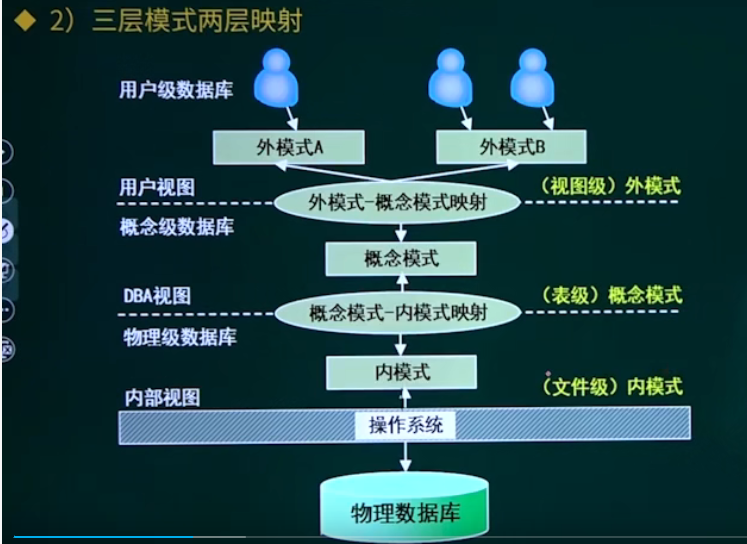

数据库的设计过程
* 需求分析-概念结构设计-逻辑结构设计-物理设计。

        1. 需求分析：分析用户的需求，包括数据、功能和性能需求；得到数据流图、数据字典和需求说明书。
        2. 概念设计：用数据模型明确地表示用户的数据需求。其反应了用户的现实工作环境，与数据库的具体实现技术无关。**(ER模型)**
        3. 逻辑设计：根据概念数据模型及软件的数据模型特性，按照一定的**转换规则和规范化理论**，把概念模型转换为逻辑数据模型，如层次模型、网状模型、关系模型等。
        4. 为一个确定的逻辑数据模型选择一个最适合应用要求的物理结构的过程。

数据模型
* 概念数据模型/信息模型：按用户的观点对数据和信息建模，是现实世界的第一层抽象，主要用于数据库设计。(ER模型/实体联系模型)
* 基本数据模型/逻辑数据模型：按计算机系统的观点对数据建模，是现实世界对数据特征的抽象，用于对DBMS的实现。

        1. 层次模型(HIerarchical Model)：用树形结构表示实体及其之间的关系。
        2. 网状模型(Network Model)：用网状结构表示实体及其之间的关系。
        3. 关系模型(Relational Model)：用二维表结构表示实体及其之间的联系。
        4. 面向对象模型(object Oriented MOdel)：采用面向对象的方法来设计数据库。
* 数据模型的三要素

        1. 数据结构：是所研究的对象类型的集合，是对系统静态特性的描述。
        2. 数据操作：对数据库中各种对象(类型)的实例(值)允许执行的操作的集合，是对系统动态特性的描述。
        3. 数据的约数条件：是一组完整性规则的集合。对于具体的应用数据必须遵守特定的语义约束条件，以保证数据的正确、有效和相容。它由三种组成：实体完整性约束(规定基本关系R的主属性A不能取空值)；参照完整性约束/引用完整性(关系模型中实体与实体间的联系)；用户自定义完整性约束(针对某一具体的关系数据库的约束条件，所涉及的数据必须满足的语义要求，由环境决定)

### 数据流图
数据流图是一种结构化设计工具，以图形的方式描绘数据在系统中流动和处理的过程。分别用下图中的图形表示对应的过程。

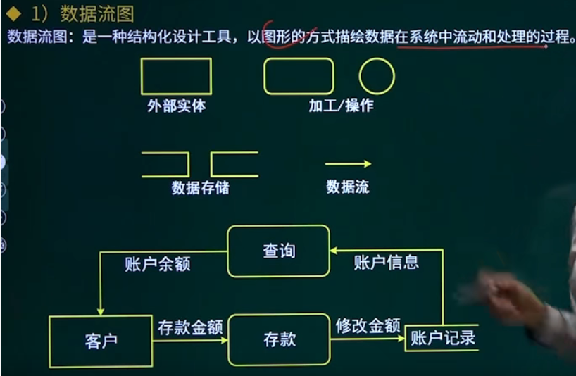

* 外部实体：系统中数据的外部来源和去处。存在于系统之外的人员、组织或其他系统。
* 加工：对数据的逻辑处理功能，也可看做是对数据的变换操作。
* 数据存储：表示某种数据保存后的逻辑统称(一般名称时xx文件，xx表)
* 数据流：加工功能的输入数据或输出数据。

        1.流入数据存储的数据流：将加工后的数据写入或修改到数据存储中。
        2.流出数据存储的数据流：从数据存储中查询获取数据，不改变原数据。

其他需求分析工具
* 除了数据流图，在需求分析阶段还会用到以下工具：

        1. 数据字典：定义数据流图中各个成分的具体含义。
        2. 判定表：描述加工逻辑，对于不同条件的不同处理方式。
        3. 判定树：与判定表相同，用叶子结点表示活动，用根节点表示问题的名字。

### 概念模型(ER模型)

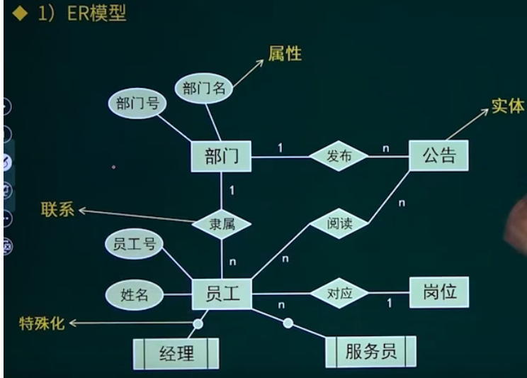

用正方形来表示实体，用椭圆形来表示实体的各个属性，用菱形来表示联系。

* 实体：实体集是相同属性的实体集合，每个实体有一组特性(属性)来表示
* 属性：

        1. 简单属性和复合属性(如家庭地址就是复合属性，可以细分为省、市、区)
        2. 单值属性和多值属性(一个属性对应的值的个数，职工亲属有多个，电话只能有一个)
        3. Null属性：无意义或不知道
        4. 派生属性：可以通过其他属性得知(如参加工作时间和工作年限，他俩差不多的意思)
* 联系：两个不同实体之间的联系有一对一(座位)，一对多，多对多。

### 关系模型

主键：关系型数据库中的一条记录中有若干个属性，若其中某一个属性组可以唯一标识一条记录，该属性组就可以成为一个主键。主键是唯一的，一个数据表中只能包含一个主键(不能重复不能为空)，候选键就是所以可以成为主键的实体，因此候选键可以有多个。
* 例如学生表中，一个学生的姓名和性别并不能确定某个特定的实体(多个相同的名字)，而身份证是能唯一确定一个的，因此它能作为主键。如果一个表中有身份证号和学号，他们都可以当做主键，那么只能选择一个作为主键，他们两个都是候选键。

复合键(组合键)：将多个列作为一个索引(该字段/属性没有重复)键，一般用于复合索引。
* 例如一个成绩表中有学号，课程号，成绩，一个学生可以考多个课程，一个课程又有多个学生考，这个时候就必须要组合学号和课程号才能符合主键的概念。

外键：用于与另一张表建立关联。如果A表中的一个字段，是B表的主键，那他就可以是A表的外键。

### SQL语言

创建表：
 * CRATE TABLE <表名1>(<列名><数据类型>[列级完整性约束条件])
 * 完整性约束条件有NULL(可以取空值)、NOT NULL(不能取空值)、UNIQUE(取值唯一)PRIMARY KEY(主键)、FOREIGN KEY(外键)、外键还需要知道一个信息，就是它是哪个表的主键。用REFERENCES(另表主键)标识。

修改与删除
* 用于修改结构，属性或者说字段
* ALTER TABLE<表名>
* [ADD <新列名><数据类型><列级完整性约束条件>]------添加属性列
* [DROP <列名/完整性约束条件>]-------------------------------删除属性列
* [MODIFY/CHANGE<列名><数据类型>]---------------------修改属性列的数据类型
* [CHANGE<列名><新列名><数据类型>]---------------------修改属性列名
* DROP TABLE<表名> 例如用"DROP TABLE Student" 删除表 Student。

数据更新

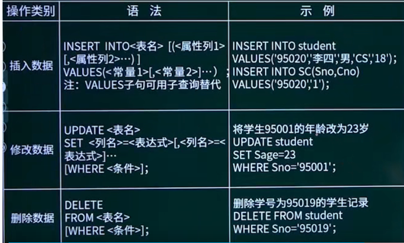

创建索引
* 索引是某个表中的一列或者若干列值的集合，
* 聚集索引确定表中数据的物理顺序。由于聚集索引规定数据在表中的物理存储位置，因此一个表**只能有一个聚集索引**,但该索引可以包含多个列(组合索引)，就像电话簿的名字和姓氏。非聚集索引的逻辑顺序与磁盘上行的物理存储顺序不同。

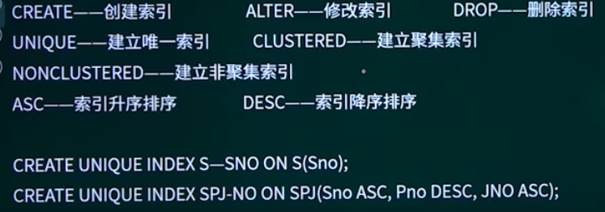

查询语句
* SELECT 列名，列名，列名
* FROM 表名
* WHERE 查询条件
* GROUP BY 将查询条件按列值分组，[HAVING <条件表达式>]对分组结果筛选。

*连接查询：若设计两个以上的表。 FROM后面有多个表名。查询时应注意WHERE条件语句，需要使用**表名.属性 = 表名.属性**。使两个表的外键和主键连接起来。

别名和匹配
* AS子句为关系和属性指定不同名称或者别名Old-name AS New-name进行设置别名。
* LIKE用于对字符串进行模糊匹配。%为匹配任意字符串，_为匹配任意一个字符。
* 例如：
SELECT Sname
FROM S
WHERE LIKE '%科技路%'匹配前面含有任意字符串或后面含有任意字符串的值。_就代表任意一个字符。

### 数据库的控制
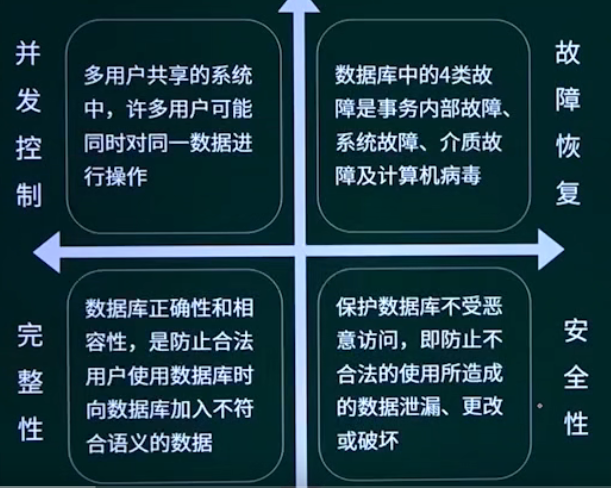

考试内容就是它们进行匹配

为了解决并发控制产生的问题：有两个锁
* s锁(共享锁)，又称为读锁，加上后其他人只能读，不能写。别人可以继续加s锁，但不能加x锁
* x锁(排他锁)，又称写锁，加上后别人既不能读也不能写。其他人不能再加任何锁。

# 计算机网络基础知识

### OSI参考模型

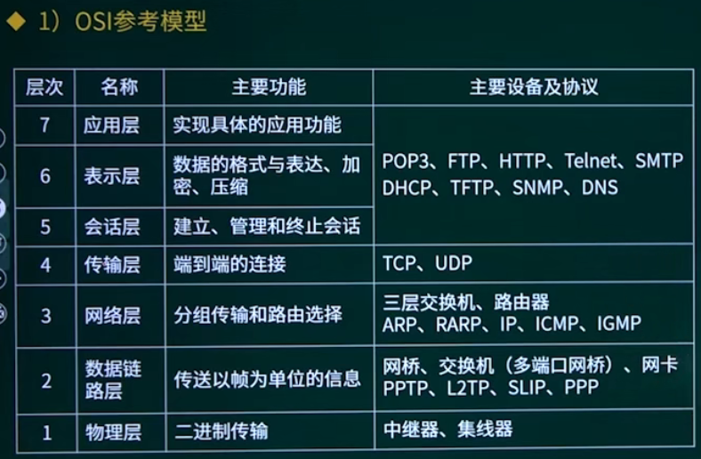

* 数据是由表中从下往上传输。
* 中继器与集线器用于增加传输距离。
* 数据链中的传输协议考试中不会涉及。
* 应用层与表示层和会话层的关系密不可分。
* OSI模型是标准化组织提出的一个标准框架，是理论框架。
* TCP/IP协议簇是现代Internet的核心协议，是实际框架。

### TCP/IP协议簇
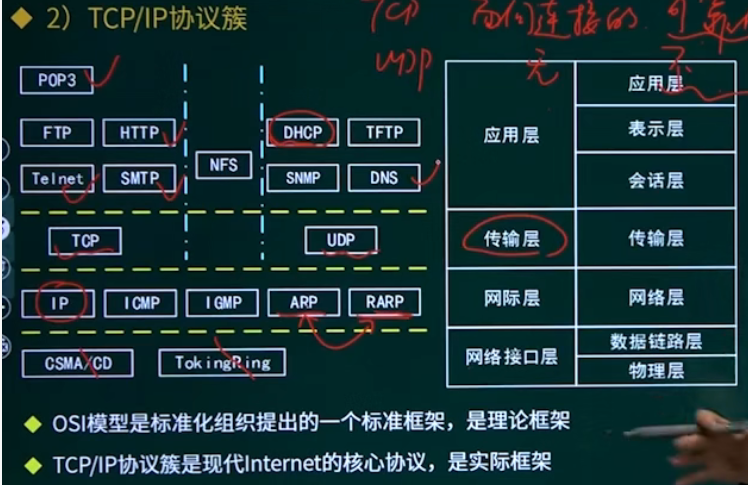

* 每个协议后面都有一个p，它是英文protocol协议的缩写。
* IP协议是任何一个设备连接入网都会有一个IP地址对应，每个设备都需要遵循这个协议才能连接入网。IP地址一般不是固定的，会随着地点不同而改变。而MAC地址(也叫物理地址)是不会变的，它相当于是电子设备的身份证全球唯一，用于在局域网内把数据精确传输到设备。
* ICMP网络控制协议，检查有没有出错。control
* ARP地址解析协议，RARP反地址解析协议。ARP是IP查MAC地址，而RARP是MAC地址查IP地址
* TCP是面向连接的，可靠的传输；UDP是面向无连接的，不可靠的传输，速度比较快。
* 应用层的协议需要使用相应的传输层的协议。
* POP3和SMTP都是针对电子邮件，POP3是针对邮件的接收，SMTP是针对邮件的发送。
* FTP针对文件传输，file transporte protocol
* HTTP(超文本传输协议)传输网页的协议，HTTPS是更安全的形式，而HTML是用于编写网页的语言
* Telnet是远程登录协议，用于在本地控制远程的电脑。
* NFS和SNMP、TFTP考试中不会涉及。
* DHCP自动分配网络地址协议。
* DNS是域名系统，将域名与对应的IP连接在一起，所有的网页使用的网址本质上是服务器的IP地址，由于IP地址不好以及，因此有了域名。

### IP地址与子网划分

IP地址由四个数组成，这个数原本是八位二进制数表示的，为了方便用户而改成了十进制。

IP地址分为三类
* 他们三类分别为A、B、C类，他们的区别是第一位数字的范围不同，其他三位的范围都是0到255，A类是0到127，B类是128到191，C类是192到223。后面的不考。**根据第一位数字的区间范围即可分辨出网络位和主机位，并得出子网掩码。**
* 一个IP地址由网络位和主机位组成，A类的网络位是前一个字节(十进制第一位)，B类的网络位是前两个字节，C类的网络位是前三个字节。

子网划分
* 利用子网掩码来区分IP地址中的网络号和主机号。
* 子网掩码同样是32位二进制组成，它的组成形式一连串的1和一连串的0。1对应的是网络位，0对应的就是主机号。
* 主机号非全0和非全1代表可作为子网中的主机号使用。
* 主机号全0地址代表这个网络本身，可作为子网地址使用。
* 主机号全1地址代表特定子网的广播地址。
* 子网地址与子网掩码的关系是逻辑与，因为子网掩码是连串的1和0，所以子网地址也就是网络位IP加主机位都是0。

### 特殊IP
127网段：本地还回地址，用于网络软件测试，不能作为主机地址。
0.0.0.0：本网络上的本主机，只能用做源地址。
私有IP：局域网中使用，通过互联网无法访问私有IP。

IPV4与IPV6
* IPV6的地址长度是128位，具有更大的地址空间。
* 具有更高的安全性。
* 允许扩充。

### URL
URL就是网络连接，连接中的各个字符都有各自的含义
DNS域名系统
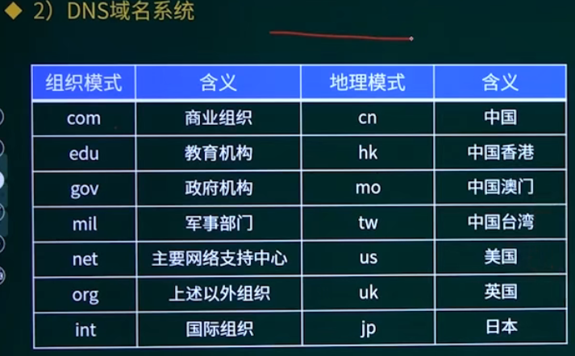

考试中会给你一个URL链接，问是属于哪个国家或组织。

### 网络安全
主动攻击与被动攻击
* 主动攻击：更改信息和拒绝用户使用资源的攻击，攻击者对某个连接中通过的数据进行各种处理。

        1. 拒绝服务攻击(DOS攻击)：亦称洪水攻击，通过漏洞进行攻击使服务挂掉、发送大量数据包占用系统资源等方式，使目标电脑的网络或系统资源耗尽，使服务暂时终止，导致正常用户无法正常访问。
        2. 分布式拒绝服务攻击(DDOS)攻击：通过大量合法或伪造的请求占用大量网络等资源，以达到瘫痪网络以及系统的目的。
* 被动攻击：截获信息的攻击。

非对称加密：加密与加密用的不同的药匙

# 知识产权
### 著作权
著作权：作品完成时自动产生，固定在某种有型物体上，又叫做版权。

如果将作品赠与他人，那么作品的拥有权会变成他人，但是著作权是不变的。

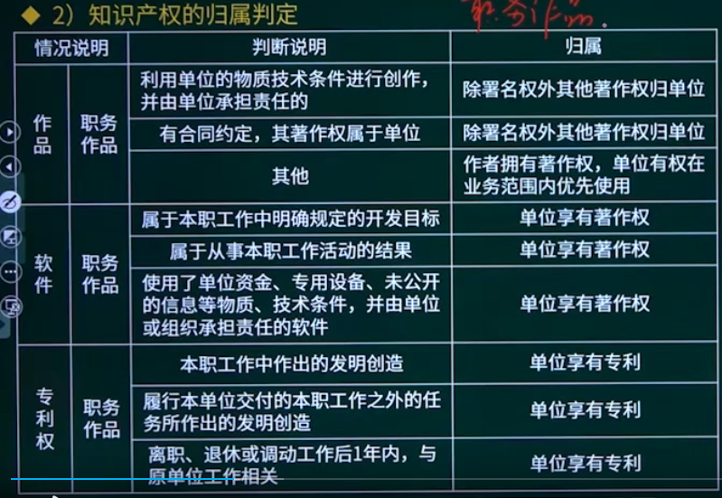

考试常考，问一个作品是否属于职务作品。

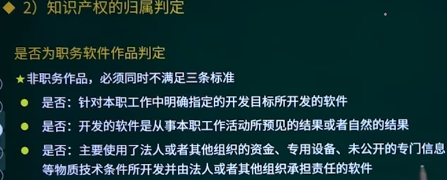

### 其他权利
商标和专利权一定要申请才收到保护，专利授予给最先申请的人。

