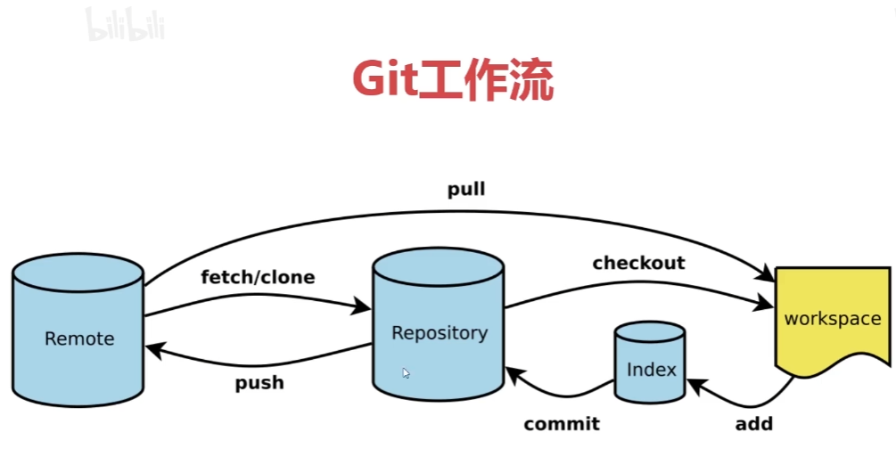

# VScode 快捷键

Ctrl + c 复制
Ctrl + v 粘贴
Ctrl + x 剪切
Ctrl + f 查找
Ctrl + h 替换
Ctrl + / 行注释
Shift + alt + a 块注释
Ctrl + shift + Enter：上方插入一行(光标移到上一行)
Ctrl + Enter：下方插入一行(光标直接移到下一行)
Alt + shift + f:格式化代码(使代码变得规范)

# git使用方法
gitbash 是在当前文件夹调出git的命令行。git的所有操作均通过命令行进行。

remote远程仓库。repository本地仓库，workspace工作区。

下载git之后首先配置用户名与邮箱
* git config --global user.name 'user_name'
* git config --global user.email 'email'
使用gitclone克隆远程仓库，记得在需要的文件夹内gitbash
* git clone 'GitHub仓库的URL'
上传文件，注意git命令行里的文件夹地址是否正确，输入一段文件名后使用TAB系统会自动补全文件夹名称。
* git cd 目标文件夹
* git add 新增的文件/发生改变的文件夹
提交文件，要提交单个文件可以commit后面加上文件夹名称，否则就是全部提交，-m代表提交信息，一定要加，里面的内容为注释/解释本次提交，git push就是直接把本地库的修改，提交到远程库。第一次push会出现，确认连接库的提示。
* git commit -m 
* git push
拉取文件，别人的修改可以直接通过pull拉取到本地。直接在GitHub里修改的内容也可以直接pull到本地。
* git pull
* git checkout 文件名。可以把不小心删除的文件找回来。

# 在vscode中使用git
在源代码管理器中，文件名旁边的字母显示的是这个文件当前的状态。

* U(untracked)：新建了这个文件，且还没有提交到GitHub上。
* D(delete)：删除了这个文件
* M(modified)：在GitHub上已经有了这个文件，然后你对这个文件进行了修改。
* 数字表示有几个错误
* 文件上的加号可以暂存更改，也就是上传到本地仓库。
* 在上传之前一定要在源代码下面的方框中输入提交注释。
* 源代码管理旁边的三点中有个推送，点击即可推送到远程仓库。

# css peek
可以通过按住左ctrl把鼠标放在id或class即可显示对应的css样式点击可直接跳转。

